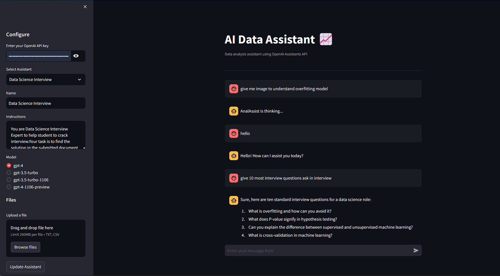

# Assistant OpenAI


This Python script utilizes the OpenAI API to create an assistant, ingest data, and provide assistance in a conversation. The script is designed to interact with OpenAI's GPT models to respond to user queries based on a knowledge base.


## Demo Solution

### UI
<!-- Example Logo -->


## Prerequisites

Before running the script, make sure you have the following:

- Python installed (version X.X.X)
- OpenAI API key
- A .env file with the OpenAI API key (refer to the provided sample.env)

## Getting Started

Follow these steps to set up the environment and run the OpenAI Assistant Python script:

### 1. Clone the Repository

```bash
git clone https://github.com/bayesianinstitute/Assistant_OpenAI.git
```

### 2. Navigate to the Project Directory

```bash
cd Assistant_OpenAI
```

### 3. Create and Activate a Virtual Environment

```bash
python -m venv venv
```

On Windows:

```bash
.\venv\Scripts\activate
```

On macOS/Linux:

```bash
source venv/bin/activate
```

### 4. Install Dependencies

```bash
pip install -r requirements.txt
```

### 5. Set Up Environment Variables

Create a .env file in the project directory:

```bash
touch .env
```

Open the .env file and add your OpenAI API key:

```plaintext
OPENAI_API_KEY=your_api_key_here
```

Save and close the .env file.

### 6. Run the Application

```bash
cd app
```

```bash
python main.py
```

### 7. Enter Your Question

Follow the prompts and enter your question when prompted.


## Contributing

Contributions are welcome! If you have any improvements or suggestions, feel free to open an issue or submit a pull request.

## License

This project is licensed under the MIT License - see the [LICENSE.md](LICENSE.md) file for details.

## Acknowledgments

- [OpenAI](https://openai.com/) for providing the powerful GPT models.

Feel free to customize the README according to your project's specific details and requirements.